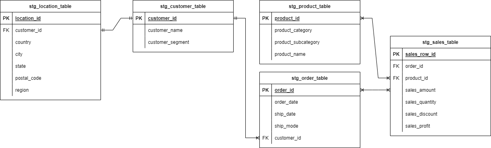

# Superstore Data Modeling Tutorial

Welcome to the Superstore Data Modeling Tutorial repository! This project focuses on demonstrating data modeling techniques using a comprehensive dataset from a fictional superstore. Through this tutorial, we processed data from Excel files, normalized them into distinct tables, and develop a data model following snowflake schema using python.

## Dataset Overview
The dataset provided in this tutorial includes three sheets:
- **Orders**: Contains detailed information about sales orders, including customer details, product information, and sales performance.
- **People**: Contains information about individuals or personnel, linked to specific regions.
- **Returns**: Tracks returned products and associates them with the original order.

Download the dataset from [Kaggle](https://www.kaggle.com/datasets/yesshivam007/superstore-dataset?resource=download)

## Jupyter Notebooks
- **data_model_excerise_p1.ipynb**: This notebook contains exercises where Python is used to navigate PostgreSQL to create simple tables. It serves as a primer for understanding basic PostgreSQL operations.

- **data_model_excerise_p2.ipynb**: In this notebook, the main project is situated. Python is used to process the data file and build the data model. Here, you'll find the steps for processing the Excel file, splitting the sheets into tables, and populating the PostgreSQL database.

## ERD
In the ERD image, you can visualize the relationships between the different tables in the data model.
